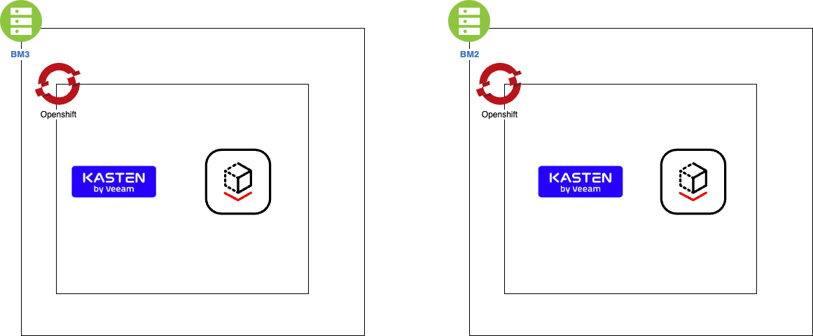
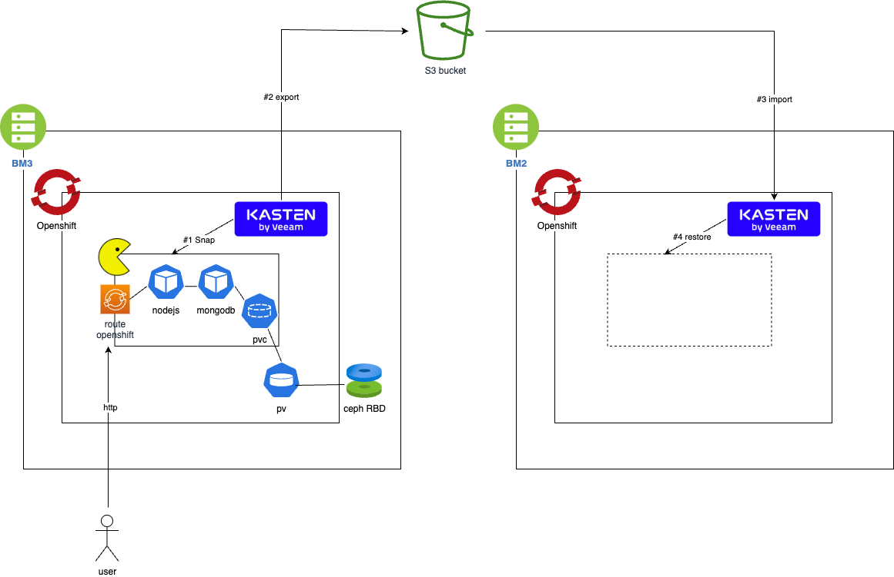
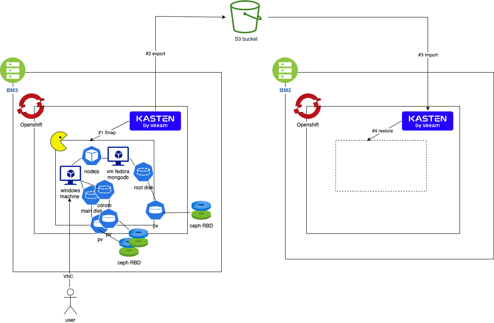

# OCP-V Demo

This is a demo for showing Kasten support for backing up OCP-V/kubevirt workload.

## Environment

Two OCP clusters, bm3 (bare metal 3) and bm2 (bare metal 2) with OCP-V and Kasten installed.
- Openshift 4.11.26 
- Kasten 6.0.3
- Openshift Virtualization 4.11.4
- ODF 4.11.9 



## Kasten installation 

We deploy the Kasten operator with argocd, we use tokenAuth as a simple Openshift Authentication mechanism.

Documentation about that can be found here : https://github.com/smohandass/kasten-argocd-openshift/

Once the Kasten operator deployed use the route to access the kasten dashboard and 
```
oc whoami -t 
```
to obtain the token that you'll submit in the authentication page.

Annotate the snapshotclass 
```
oc annotate volumesnapshotclass ocs-storagecluster-cephfsplugin-snapclass k10.kasten.io/is-snapshot-class=true
oc annotate volumesnapshotclass ocs-storagecluster-rbdplugin-snapclass k10.kasten.io/is-snapshot-class=true 
```

## Scenario "classic migration" 

We do a classic migration of pods from bm3 to bm2. 



```
oc create ns pacman
helm repo add pacman https://shuguet.github.io/pacman/
helm install pacman pacman/pacman -n pacman --set route.create=true --set mongodb.containerSecurityContext.enabled=false --set mongodb.podSecurityContext.enabled=false
```

Then we proceed the migration with a transformation on the route : 
```
/spec/host
([a-zA-Z0-9-.]*)\.apps\.bm3\.url\.com
$1.apps.bm2.url.com
```

Video : 

We add a blueprint so that kasten now take also a dump of the database and restore the dump at restore.

```
oc create -f blueprint/mongodb-bp.yaml 
oc create -f blueprint/mongodb-bp-binding.yaml 
```

Video : 

## Scenario "VM Migration" 

We're going to replace/mix pod by/with VMs in order to execute a VM Micgration scenario between openshift cluster.



Install templates for VM windows and VM Fedora that has volume mode in filesystem : 
```
oc create -f templates/
```
Having volume mode on filesystem mode is a requirement for Kasten to be able to snapshot and export the machines. 
If you absolutely need to stay in block mode then you can still snapshot but not export. 

Kasten is actively working on supporting block mode for export, hence this requirement may not be true anymore at the moment you read this document.


Use the catalog to select fedora-server-small-kio template and create the vm. 

### Install mongodb in the VM 

Connect to the vm
```
virtctl console $(oc get vm | grep fedora |awk '{print $1}')
```

Install mongodb in the machine 
```
sudo vi /etc/yum.repos.d/mongodb.repo
[Mongodb]
name=MongoDB Repository
baseurl=https://repo.mongodb.org/yum/redhat/8/mongodb-org/4.4/x86_64/
gpgcheck=1
enabled=1
gpgkey=https://www.mongodb.org/static/pgp/server-4.4.asc

sudo dnf install mongodb-org mongodb-org-server
sudo systemctl enable mongod.service
sudo systemctl start mongod.service 
sudo systemctl status mongod.service 
mongod --version 
```

We want to stick to the pacman deployment accessing the database with a password 
To make the transition easier let's reuse the same name and password.
In another terminal  
```
oc get secret pacman-mongodb -o jsonpath='{.data.mongodb-root-password}' |base64 -d 
```

Create the password in the admin db 
```
use admin
db.createUser(
   {
     user: "root",
     pwd: "<Password>", // or cleartext password
     roles: [ 
       { role: "userAdminAnyDatabase", db: "admin" },
       { role: "readWriteAnyDatabase", db: "admin" } 
     ]
   }
 )
```

edit /etc/mongod.conf and change 
```
net:
  port: 27017
  bindIp: 127.0.0.1  
```

With 
```
net:
  port: 27017
  bindIp: 0.0.0.0
```

Restart mongod 
```
sudo service mongod restart
```

Check the port 27017 is open on all the interfaces
```
sudo netstat -tulpn | grep LISTEN
tcp        0      0 0.0.0.0:27017           0.0.0.0:*               LISTEN      3609/mongod 
```

### replace the mongodb pod by the mongodb vm

expose mongodb service for the vm
```
virtctl expose vm $(oc get vm --no-headers|awk '{print $1}') --port=27017 --name=fedora-vm-mongodb
```

On the mongo pod check you can connect 
```
oc rsh deploy/pacman-mongodb
mongosh --authenticationDatabase admin -u $MONGODB_ROOT_USER -p $MONGODB_ROOT_PASSWORD --host fedora-vm-mongodb
```

change the pacman deployment to use this new mongo service 
```
oc edit deploy pacman
```
change env MONGO_SERVICE_HOST by fedora-vm-mongodb


Scale down the mongodb pod 
```
oc scale deploy pacman-mongodb --replicas=0
```

Connect to the pacman app do a game and check the database on the vm.

Video : 

## Create a Windows VM to reach the pacman dashboard

Upload a cdrom image 

```
oc project openshift-virtualization-os-images
virtctl image-upload dv win-iso-w2k16 \
  --image-path=/Users/michaelcourcy/Downloads/kubevirt2/window-server-evaluation-2016.iso \
  --uploadproxy-url=cdi-uploadproxy-openshift-cnv.apps.bm3.url.com --insecure  --size=7Gi
```

Note: iso files can be downloaded from the Microsoft website.

Select the windows2k16-server-medium-kio template in the catalog and create the machine and execute it.

Connect to the machine 

```
virtctl console $(oc get vm | grep win |awk '{print $1}')
```

Notes: Mac os user will have to create a remote-viewer executable script on their latop see instructions [here](./remote-viewer-macos.md).

Install windows. On the machine open edge and connect to the pacman dashboard 

Video : 

## Adapt the blueprint for the VM 

Just edit the blueprint to change the endpoint for mongo dump and test a backup.

Video : 

## Backup the namespace and restore it on bm2 

Migrate the VM app on the bm2 cluster. 

Video :

## Misceleanous 

- clone in another namespace 
- restore on another cluster in another namespace 
- evaluate "incrementality" for VM Backup 

## Limitation 

- Support for block mode on VM should be available at the end of the year
- Complete gitops install does not work if we want complete openshift authentication, we're working on it through a more "operator" oriented install 
- Kubevirt does not support notion of backup agent controlled by the hypervisor, we're working on creating hooks when using freeze feature.


